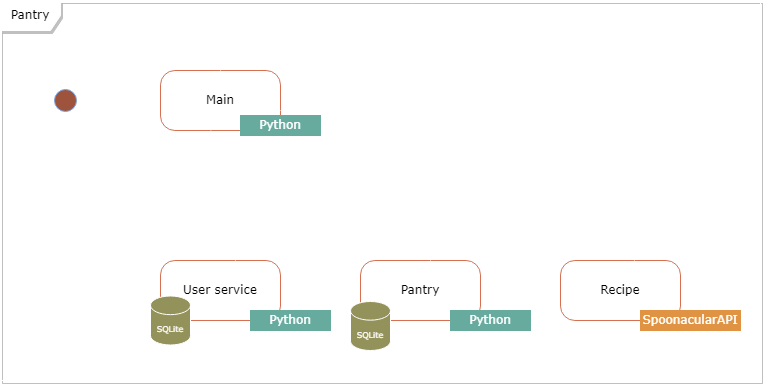
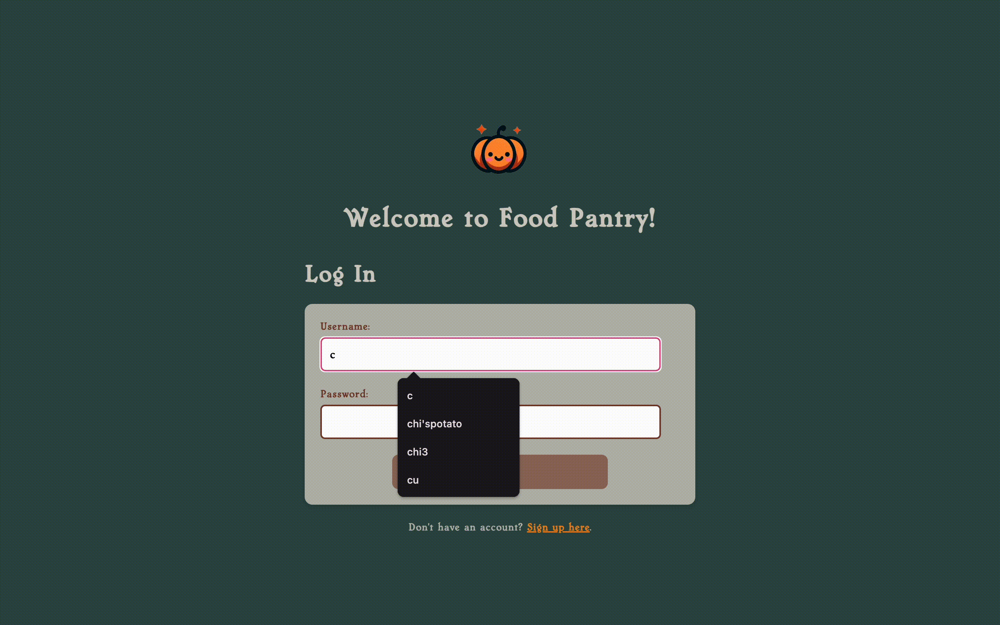
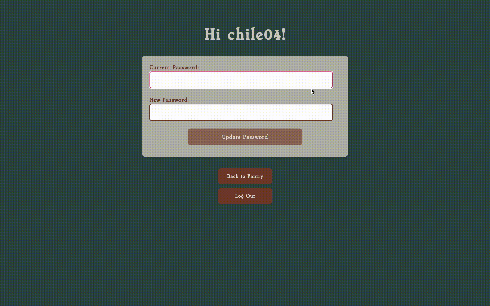
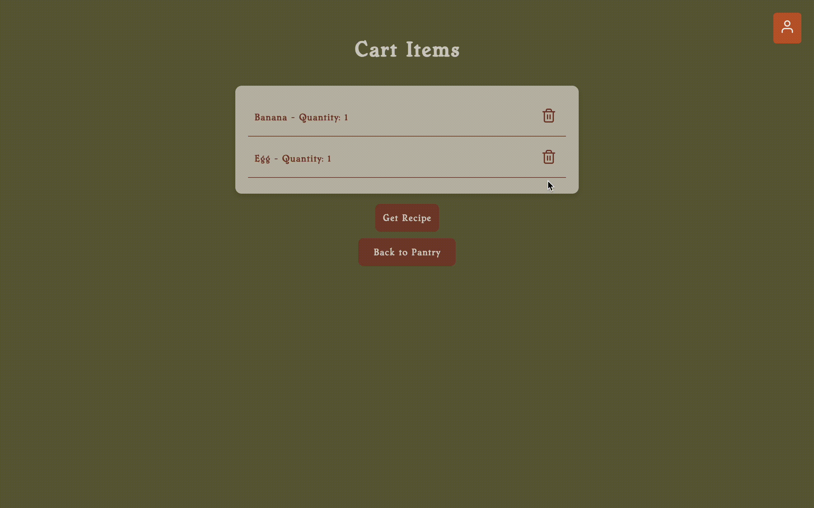

# cpsc415-project
# Food Pantry

## Application and purpose
Food Pantry is a comprehensive web application designed to simplify the process of discovering and generating recipes based on selected ingredients available at Trinity College Food-n-Stuff Pantry. Our purpose is to offer users a seamless experience in finding and creating delicious meals using our ingredients.

## Members
1. Chi Le
2. Vy Sa Nguyen
3. Shazif Ahmed

## Description
The Food Pantry is a web application that allows users to browse and add food items to cart. The application consists of 4 main services:
1. **Main Page**: Serves as the central hub, facilitating communication between other services and managing the overall workflow.
1. **User Service**: Handles user registration, login, and profile management.
2. **Pantry Service**: Displays a pantry of available ingredients for users to select from.
3. **Recipe Service**: Generates recipes based on the ingredients chosen by the user.

The architecture of the application is designed with microservices in mind, leveraging Python Flask for building the services. Each service communicates with others via RESTful APIs, and the application is deployed on Kubernetes for scalability and reliability.

## UI
The UI of the Food Pantry is built using HTML and CSS, offering an intuitive experience for selecting ingredients and viewing generated recipes.

## Build, Run, Deployment Instructions
To build and run the application locally, follow these steps:

1. **Clone the Repository**: Clone this repository to your local machine using the following command:

    ```bash
    git clone https://github.com/lhchi04/Food-Pantry.git
    cd Food-Pantry
    ```
2. **Build and push images**
    ```bash
    docker build --platform linux/arm64,linux/amd64 -t username/main:0.1.4 .
    docker build --platform linux/arm64,linux/amd64 -t username/user:0.1.4 .
    docker build --platform linux/arm64,linux/amd64 -t username/pantry:0.1.4 .
    docker build --platform linux/arm64,linux/amd64 -t username/recipe:0.1.4 .

    docker push username/main:0.1.4
    docker push username/user:0.1.4
    docker push username/pantry:0.1.4
    docker push username/recipe:0.1.4
    ```
3. **Deploy to Kubernetes**
    ```bash
    kubectl apply -f kubernetes/init
    kubectl apply -f kubernetes/others
    ```
4. **Verify deployment**
    ```bash
    kubectl get pods -A
    ```
## Application Usage Instructions
Follow these steps to make the most of the features available.

### 1. Registration and Login

To access the Food Pantry, you first need to sign up.
After registering, you will be lead to the pantry page.
After signing up, your information is kept and you can log in next time.

### 2. Managing Your Profile
Click on your username icon at the top right of the page to view your profile.
In your profile page, you can update your password or log out.

### 3. Browsing the Pantry
You can choose any ingredients that you want or have like dairy, grains, fruits, and vegetables and add to cart. You can go back and add more whenever you want.

### 4. Managing Your Cart
In the cart, you can remove items if needed.

### 5. Generating Recipes
With ingredients added to your cart, you can generate recipes based on your choice.
You can view details of all recipes.

### 6. Signing Out
To logout, click on your username and select 'Logout' from the dropdown menu to exit securely.

## Component Diagram


(This diagram reflects our ideal of having a database integrated in the program; however due to technical difficulties in attempting to run the app on GKE, the final repo has dict to store the data in microservice2_pantry and microservice3_user)

## Dependencies
- Flask-RESTful: An extension for Flask that adds support for quickly building REST APIs.
- spoonacular API: An API for recipe generation and food data.
- Kubernetes: An open-source container orchestration platform for automating deployment, scaling, and management of containerized applications.
- Docker: A platform for developing, shipping, and running applications in containers.

## Features (Minimum Viable Product)
- User registration and authentication
- Browse available ingredients in the pantry
- Select ingredients
- Generate recipes based on selected ingredients

## Data Transmitted Between Services
### Main Service and User Service
1. **User Authentication**: The Main Service sends user authentication requests to the User Service, including login credentials and registration data.
2. **User Profile Management**: The User Service provides endpoints for managing user profiles, allowing the Main Service to retrieve and update user information.

### Main Service and Pantry Service
1. **Ingredient Pantry**: The Pantry Service sends ingredient data to the Main Service, allowing users to browse and select ingredients for recipe generation.

### Main Service and Recipe Service
1. **Recipe Generation Requests**: The Main Service forwards user-selected ingredients and preferences to the Recipe Service to generate personalized recipes.

### Error Handling
Appropriate error messages or status codes are transmitted between the microservices to handle exceptions and provide user feedback.

## Screenshots/GIFs






## Citations
- Spoonacular API: https://spoonacular.com/food-api

## License
This project is licensed under the MIT License - see the LICENSE file for details.

## Additional Notes
- **Docker Username**: Replace `username` with your actual Docker Hub username or your private registry URL.
- **Customization**: Adjust paths and namespaces according to your actual Kubernetes setup and directory structure.

This README provides a comprehensive guide for developers to set up and understand the Food Pantry application, including instructions for building, deploying, and maintaining the application. Adjust the document according to the specific paths and settings of your project structure as needed.
