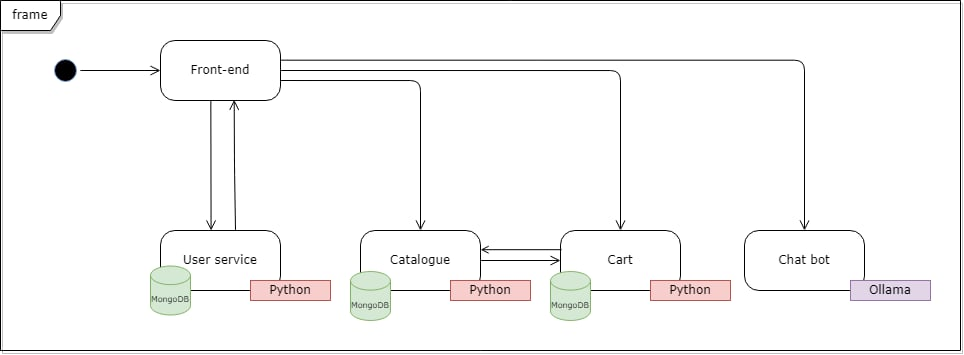

# cpsc415-project
# Online Thrift Store

## Application and purpose

## Members
1. Chi Le
2. Vy Sa Nguyen
3. Shazif Ahmed

## Description
The Online Thrift Store is a web application that allows users to browse and add second-hand items to cart. The application consists of 4 main services:
1. **Product Page**: talks to **User Profile Service**, **Cart Service**, and **Chatbot Service**
1. **User Profile Service**: Manages user registration, login, and profile management, talks to **Cart Service**
2. **Cart Service**: Handles the shopping cart, allowing users to add items and view the cart, talks to **User Profile Service**.
3. **Chatbot Service**: Utilizes artificial intelligence to provide assistance to users, answer queries related to products, and offer recommendations.

The architecture of the application is designed with microservices in mind, leveraging Python Flask for building the services. Each service communicates with others via RESTful APIs, and the application is deployed on Kubernetes for scalability and reliability.

## UI
The UI of the Online Thrift Store is built using HTML and CSS. It provides a user-friendly interface for browsing items, managing the shopping cart, and interacting with the chatbot.

## Build, Run, Deployment Instructions

## Application Usage Instructions
[Provide instructions for users on how to interact with the application. Include how to register, browse items, add items to the cart, and use the chatbot feature.]

## Component Diagram

## Screenshots/GIFs

## Dependencies
- Python Flask
- Flask-RESTful
- OpenAI API (for chatbot)
- Kubernetes
- Docker

## Features (Minimum Viable Product)
- User registration and authentication
- Browse items
- Add items to the cart
- View cart
- Chatbot assistance

## Citations

## Entrepreneurial Branding Elements